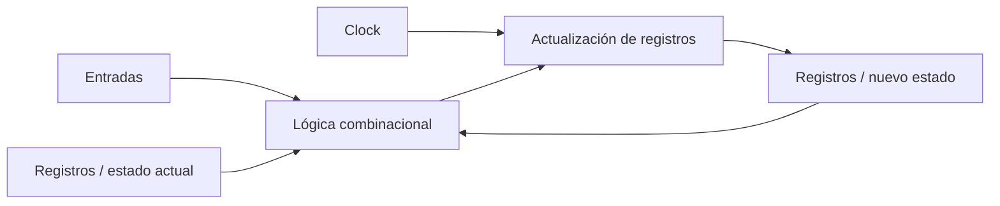
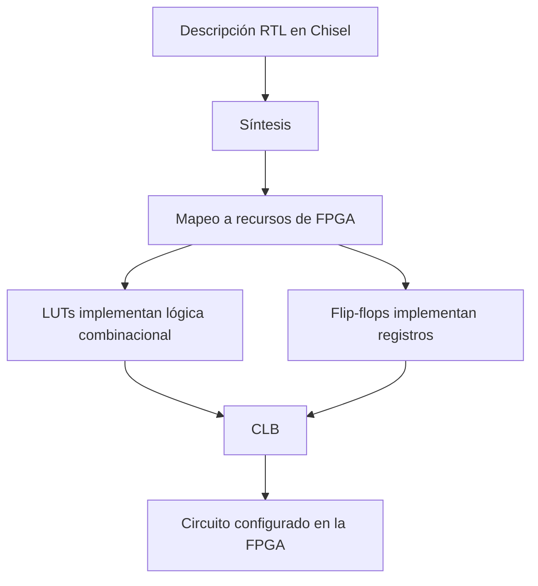
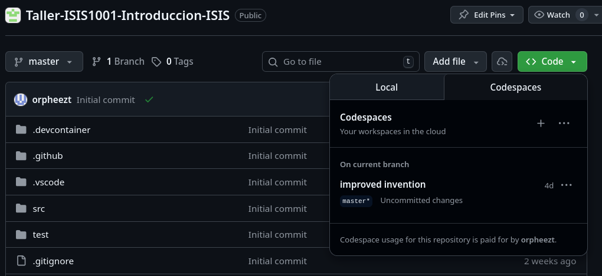
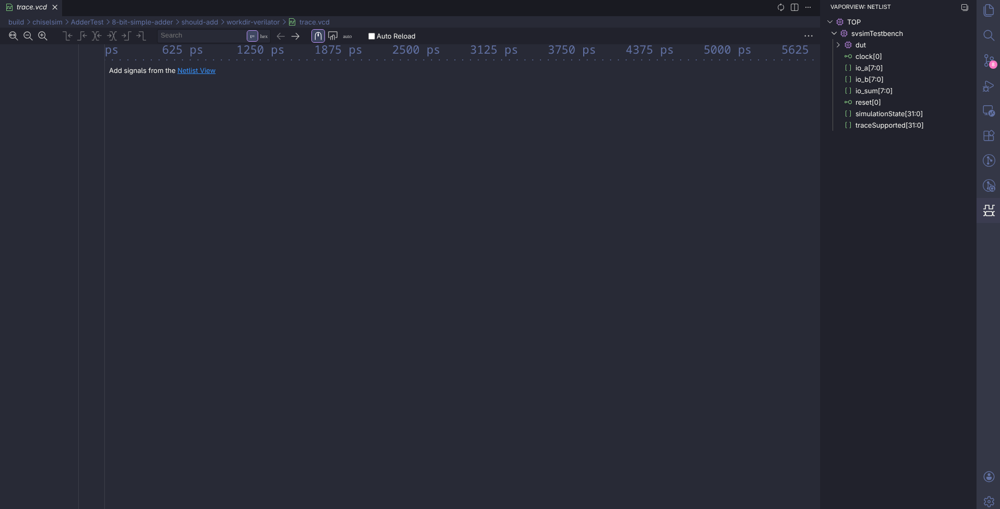
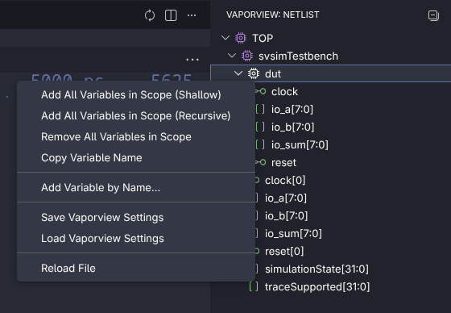
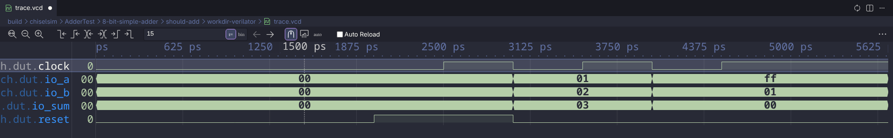
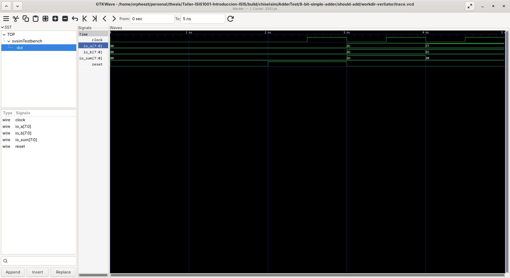
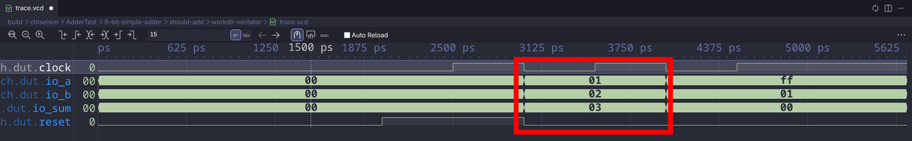

# Taller: Introduccion a Sistemas digitales con Chisel

## 1. Descripción del Taller

En este taller los estudiantes aprenderán cómo se diseñan circuitos digitales usando código, cómo funciona el diseño a nivel RTL (Register Transfer Level) y cómo estos diseños pueden ejecutarse en hardware real mediante FPGAs.

Trabajaremos con:

- Chisel (Hardware Description Language embebido en Scala)
- Visualización de señales con: `VaporView` o `GTKWave`

## 2. Objetivos del Taller

Al finalizar el taller, el estudiante será capaz de:

1. Entender la diferencia entre programación de software y descripción de hardware.

2. Explicar qué significa RTL.

3. Comprender qué es una FPGA y cómo funciona.

4. Escribir módulos simples en Chisel.

5. Simular circuitos digitales.

6. Visualizar señales digitales en un visor de formas de onda (`waveform`).

## 3. Conceptos Fundamentales

### 3.1 ¿Qué es RTL?

RTL (Register Transfer Level) es una forma de describir sistemas digitales basada en:

- **Registros (almacenamiento):** son elementos de memoria que conservan un valor entre ciclos de reloj. Un registro no cambia continuamente; normalmente captura un nuevo dato solo cuando ocurre un flanco del reloj. En RTL, los registros representan el **estado** del sistema.

- **Lógica combinacional:** es la parte del circuito que calcula salidas a partir de las entradas actuales, sin recordar el pasado. Por ejemplo, sumadores, comparadores, multiplexores y compuertas lógicas forman lógica combinacional. Si una entrada cambia, la salida puede cambiar casi de inmediato.

- **Reloj (`clock`):** es la señal periódica que sincroniza el sistema. El reloj divide la ejecución en instantes discretos y permite que muchos registros se actualicen de manera coordinada. En diseño digital, el reloj ayuda a organizar cuándo se captura y cuándo se procesa la información. Un **flanco de reloj** es el instante en que la señal cambia de nivel, normalmente de `0` a `1` (*flanco de subida*) o de `1` a `0` (*flanco de bajada*). Muchos registros se actualizan exactamente en uno de esos flancos. Un **ciclo de reloj** es el intervalo completo entre un flanco y la repetición equivalente del siguiente, por ejemplo entre un flanco de subida y el siguiente flanco de subida. Durante ese ciclo, la lógica combinacional dispone de tiempo para calcular el próximo valor que luego será almacenado por los registros.

- **Transferencia de datos entre registros:** la idea central de RTL es que, en un ciclo de reloj, la lógica combinacional transforma datos y, en el siguiente flanco, los registros almacenan el resultado. Por eso se habla de *Register Transfer Level*: describimos cómo viajan y se transforman los datos entre registros.

- En hardware, todo ocurre en paralelo, no secuencialmente como en software. Esto significa que varias operaciones pueden existir activas al mismo tiempo, siempre que estén implementadas como parte del circuito.

#### 3.1.1 Intuición de flujo en RTL

Una forma útil de pensar en RTL es esta:

1. Unos registros contienen el estado actual.
2. La lógica combinacional toma ese estado y las entradas del sistema.
3. Se calcula un nuevo resultado.
4. En el siguiente flanco de reloj, ese resultado se guarda en registros.

Así, el sistema avanza de un estado al siguiente en pasos sincronizados.



#### 3.1.2 Relación con la implementación física en una FPGA

Cuando escribimos RTL, no estamos indicando instrucciones para una CPU. Estamos describiendo una estructura de hardware que luego será implementada físicamente dentro de la FPGA usando bloques internos de lógica y almacenamiento.

Dos conceptos importantes aquí son:

- **LUT (Look-Up Table):** una LUT es un pequeño bloque de memoria usado para implementar funciones lógicas. En lugar de construir cada operación con compuertas de forma manual, la FPGA puede configurar una LUT para que produzca la salida correcta según una combinación de entradas. Por ejemplo, una LUT puede comportarse como una puerta AND, OR, XOR o incluso como una función booleana más compleja.

Un ejemplo simple es implementar `XOR` con una LUT de 2 entradas. La LUT guarda la salida esperada para cada combinación posible de `a` y `b`:

| a | b | XOR |
|---|---|-----|
| 0 | 0 |  0  |
| 0 | 1 |  1  |
| 1 | 0 |  1  |
| 1 | 1 |  0  |

En este caso, la LUT se configura con esos cuatro valores para que, al recibir `a` y `b`, entregue exactamente la salida de la función `XOR`.

- **CLB (Configurable Logic Block):** un CLB es un bloque lógico configurable que agrupa recursos internos de la FPGA, normalmente incluyendo LUTs, registros (`flip-flops`) y lógica adicional de conexión o acarreo. En términos prácticos, el CLB es una unidad de construcción con la que la FPGA materializa el RTL que escribimos.

En resumen:

- La **lógica combinacional** del RTL suele implementarse principalmente con **LUTs**.
- El **estado** del sistema suele implementarse con **registros** o `flip-flops`.
- Estos recursos suelen estar organizados dentro de **CLBs**.



### 3.2 ¿Qué es una FPGA?

Una FPGA (*Field-Programmable Gate Array*) es un dispositivo de hardware reconfigurable que permite implementar circuitos digitales personalizados.

A diferencia de una CPU, una FPGA no se dedica a ejecutar instrucciones de manera secuencial. En cambio, se configura para construir directamente la lógica digital que resuelve un problema específico.

Esto significa que una FPGA puede describirse como un hardware adaptable: en lugar de programar una serie de pasos, se diseña la estructura del circuito que realizará la tarea.

Comparación general:

| CPU | FPGA |
| ----- | ------ |
| Ejecuta instrucciones | Implementa circuitos digitales |
| Procesamiento principalmente secuencial | Procesamiento inherentemente paralelo |
| Se programa con software | Se configura como hardware |

## 3.3 ¿Qué es Chisel?

Chisel es un lenguaje moderno de descripción de hardware que permite diseñar circuitos digitales de una forma más expresiva y flexible.

En lugar de escribir directamente en Verilog, Chisel permite describir el hardware usando construcciones de más alto nivel, y luego generar automáticamente el código Verilog correspondiente.

Está desarrollado dentro del ecosistema de CHIPS Alliance y se utiliza tanto en proyectos académicos como en aplicaciones industriales.

## 4. Entorno de Trabajo

Este repositorio incluye una configuración de `devcontainer`, lo que permite abrir un entorno de desarrollo ya preparado con las herramientas necesarias para compilar, probar y simular los ejercicios del taller.

### 4.1 Opción recomendada: abrir el repositorio en GitHub Codespaces

1. Abra el repositorio en GitHub.
2. Haga clic en el botón **Code**.


3. Vaya a la pestaña **Codespaces**.



4. Seleccione **Create codespace on main**.
5. Espere a que GitHub construya el entorno y abra VS Code en el navegador.

Cuando el Codespace termine de iniciar, ya estará dentro del `devcontainer` y podrá usar la terminal integrada para ejecutar comandos como:

- `./mill compile`
- `./mill test -DemitVcd=1`

### 4.2 Opción local: abrir el proyecto en VS Code usando Dev Containers

Si desea trabajar desde su computador, puede usar Docker junto con la extensión de Dev Containers de VS Code.

1. Instale Docker.
2. Instale Visual Studio Code.
3. Instale la extensión **Dev Containers**.
4. Abra la carpeta del proyecto en VS Code.
5. Cuando VS Code detecte la configuración, seleccione **Reopen in Container**.
6. Espere a que se construya el contenedor y se abra el entorno.

Una vez abierto el contenedor, la terminal de VS Code quedará ejecutándose dentro del entorno configurado para el taller.

### 4.3 Verificación rápida

Para comprobar que entró correctamente al entorno, ejecute en la terminal:

- `./mill compile`

 Si el comando compila sin errores, entonces el entorno quedó listo para continuar con las actividades.

## 5. Chisel

### 5.1 ¿Qué es Chisel?

Chisel es un lenguaje embebido en Scala para describir hardware digital. En lugar de escribir directamente Verilog, usted describe la estructura y el comportamiento del circuito usando construcciones de Scala, y luego Chisel genera el hardware correspondiente.

La idea clave es que en Chisel no se está programando una secuencia de pasos como en software tradicional. En cambio, se está describiendo un circuito: sus entradas, sus salidas y cómo se conectan entre sí.

Un módulo en Chisel normalmente tiene tres partes:

1. La definición del módulo.
2. La interfaz de entrada y salida (`io`).
3. La lógica que conecta señales internas y externas.

Ejemplo mínimo:

```scala
import chisel3._

class SimpleAdder extends Module {
  val io = IO(new Bundle {
    val a = Input(UInt(8.W))
    val b = Input(UInt(8.W))
    val sum = Output(UInt(8.W))
  })

  io.sum := io.a + io.b
}
```

En este ejemplo:

- `Module` representa un bloque de hardware.
- `IO(new Bundle { ... })` define la interfaz del circuito.
- `UInt(8.W)` representa un entero sin signo de 8 bits.
- `:=` se usa para conectar señales en hardware.

También es común declarar señales internas:

```scala
import chisel3._

class Compare extends Module {
  val io = IO(new Bundle {
    val a = Input(UInt(8.W))
    val b = Input(UInt(8.W))
    val greater = Output(Bool())
  })

  val isGreater = io.a > io.b
  io.greater := isGreater
}
```

Aquí `isGreater` es una señal interna derivada de una operación combinacional.

 Cuando más adelante vea asignaciones como:

```scala
io.out := io.in1 & io.in2
```

debe interpretarlas como conexiones de hardware, no como instrucciones que se ejecutan una sola vez.

Para introducir lógica secuencial, considere ahora un contador:

```scala
import chisel3._

class Counter extends Module {
  val io = IO(new Bundle {
    val value = Output(UInt(4.W))
  })

  val count = RegInit(0.U(4.W))
  count := count + 1.U
  io.value := count
}
```

A diferencia de los ejemplos anteriores, aquí aparece un registro: `count`.

`RegInit(0.U(4.W))` crea una señal secuencial de 4 bits con valor inicial 0. Eso significa que el circuito recuerda su valor entre ciclos de reloj.

La asignación:

```scala
count := count + 1.U
```

indica que en cada ciclo de reloj el registro toma como siguiente valor el resultado de sumarle 1 al valor actual.

Esta es la diferencia fundamental entre lógica combinacional y lógica secuencial:

- La lógica combinacional depende únicamente de las entradas actuales.
- La lógica secuencial depende de las entradas actuales y del estado almacenado.

En otras palabras, un contador necesita memoria. Por eso no se puede describir solamente con cables y operaciones combinacionales: necesita registros que conserven información entre un ciclo y el siguiente.

### 5.2 Testbenches en Chisel

Una vez que describimos un circuito, el siguiente paso es verificar que hace lo que esperamos. Para eso usamos un **testbench**.

En hardware, un testbench no es parte del circuito final. Es un entorno de prueba que:

- le asigna valores a las entradas,
- hace avanzar el reloj,
- observa las salidas,
- y comprueba si el comportamiento es correcto.

En Chisel, los testbenches normalmente se escriben en Scala usando `ChiselSim` y `ScalaTest`.

Por ejemplo, en este taller aparece una prueba como esta:

```scala
simulate(new Adder8()) { c =>
  c.io.a.poke(1.U)
  c.io.b.poke(2.U)
  c.clock.step()
  c.io.sum.expect(3.U)
}
```

La idea general es:

- `simulate(new Adder8())` crea una instancia del circuito para probarlo.
- `c.io.a.poke(1.U)` escribe un valor en una entrada.
- `c.clock.step()` avanza la simulación un ciclo de reloj.
- `c.io.sum.expect(3.U)` verifica que la salida tenga el valor esperado.

Aunque un sumador es principalmente combinacional, en este entorno de simulación igual usamos pasos de reloj para ordenar la evaluación de los casos de prueba y mantener una metodología uniforme con circuitos secuenciales.

La operación `poke` se puede entender como “forzar” una entrada con un valor específico dentro de la simulación. La operación `expect` funciona como una afirmación: si la salida no coincide con lo esperado, la prueba falla.

Esto permite construir casos de prueba concretos. Por ejemplo:

- probar valores pequeños, como `1 + 2 = 3`,
- probar casos límite, como overflow,
- probar varios anchos de palabra si el circuito es parametrizable.

Eso último se ve en los tests de `PAdder`, donde se prueba el mismo módulo con 32, 64 y 128 bits.

La ventaja de un testbench es que obliga a pensar el hardware como un sistema que recibe estímulos y responde en el tiempo. En software muchas veces uno piensa “llamo una función y devuelve un resultado”. En hardware, en cambio, uno piensa “aplico señales, avanzo ciclos y observo qué ocurre”.

En resumen:

- el **circuito** describe el hardware,
- el **testbench** describe cómo verificarlo,
- y la **simulación** permite ejecutar esas pruebas antes de sintetizar o implementar el diseño.

### 5.3 Visualización de señales con VCD

Además de verificar que los tests pasen, muchas veces conviene observar cómo cambian las señales en el tiempo. Para eso se puede generar un archivo `VCD` (*Value Change Dump*), que guarda la traza de la simulación.

Para generar estos archivos se debe ejecutar:

```bash
./mill test -DemitVcd=1
```

Al hacerlo, cada test que emita trazas dejará un archivo en una ruta similar a esta:

```bash
build/chiselsim/<test>/workdir-verilator/trace.vcd
```

Aquí, `<test>` corresponde al nombre del test ejecutado.

#### 5.3.1 Abrir la traza con `vaporview`

`vaporview` permite **inspeccionar** la evolución temporal de las señales desde el navegador o una interfaz gráfica ligera, dependiendo de la instalación disponible.

Vaporview es una extension de vscode, si estas trabajando en Codespaces o en un DevContainer ya deberia
estar instalada.

Ve al archivo ubicado en `build/chiselsim/<test>/workdir-verilator/trace.vcd`

Haz click en el icono de la extension para desplegar las señales disponibles




Haz click derecho en `dut` e importa las señales dentro del visor



Despues podremos ver el `diagrama de forma de onda`



### 5.3.2 Abrir la traza con `gtkwave`

Otra herramienta muy común es `gtkwave`, ampliamente usada para depuración de hardware digital.

Se puede abrir así:

```bash
gtkwave build/chiselsim/<test>/workdir-verilator/trace.vcd
```

Dentro de `gtkwave` se pueden seleccionar señales internas y de entrada/salida para ver sus transiciones en el tiempo, hacer zoom sobre regiones específicas y analizar con más detalle el comportamiento del diseño.

En ambos casos, estas herramientas son especialmente útiles cuando un test falla o cuando se quiere entender paso a paso qué está ocurriendo dentro del circuito durante la simulación.



#### 5.3.3 Analisis diagrama de ondas

Usaremos la visualizacion en vaporview


Podemos ver que la adicion es instantanea, y cada test case esta ocurriendo en cada
ciclo de reloj. En este caso en el flanco de bajada (falling edge).



## 6. Evaluación del Estudiante

La evaluación del taller se divide en dos partes:

1. Evaluación teórica.
2. Evaluación práctica.

Ambas buscan comprobar que el estudiante comprende la diferencia entre lógica combinacional y secuencial, y que puede implementar, probar y analizar un diseño sencillo en Chisel.

### 8.1 Evaluación teórica

Responder de forma individual y justificada las siguientes preguntas:

1. ¿Cuál es la diferencia entre una asignación en software y una conexión en hardware descrita con Chisel?
2. ¿Qué diferencia hay entre lógica combinacional y lógica secuencial?
3. ¿Qué papel cumplen el reloj y los registros dentro de un acumulador?
4. Si una entrada de un sumador cambia, ¿cuándo cambia la salida en un circuito combinacional?
5. ¿Por qué un acumulador necesita memoria de estado y no puede implementarse únicamente con lógica combinacional?
6. ¿Qué ventaja ofrece diseñar un módulo paramétrico frente a escribir versiones fijas de 8, 16 o más bits?
7. ¿Qué significa verificar un diseño con un testbench y por qué no basta con que el código compile?
8. ¿Qué información aporta una traza VCD al proceso de depuración?
9. ¿Qué diferencias esperaría observar entre una señal registrada y una señal puramente combinacional en una forma de onda?

### 8.2 Evaluación práctica

El objetivo práctico es implementar un sumador con acumulador y reutilizarlo para construir una versión de mayor tamaño a partir de dos bloques más pequeños.

#### Parte A. Implementación base de 8 bits

Implementar un módulo `AdderAcc8` en el archivo `src/AdderAcc.scala`.
Este módulo debe representar un sumador con acumulador de 8 bits.

El estudiante debe definir claramente:

1. Las entradas necesarias.
2. La salida del acumulador.
3. El comportamiento frente al reloj.

Se espera que el módulo acumule resultados a lo largo de los ciclos y permita observar el efecto del estado interno durante la simulación.

#### Parte B. Implementación paramétrica

Implementar el módulo `PAdderAcc` como parte del trabajo asociado a `src/PAdderAcc.scala` y sus verificaciones en `test/src/PAdderAcc.scala`.

Dado el estado actual del repositorio, estos archivos deberán servir para completar la práctica indicada en el taller junto con sus verificaciones.

El módulo debe permitir configurar el ancho de palabra mediante un parámetro, de forma que la misma descripción pueda reutilizarse para distintos tamaños de datos.

La solución debe mantener la misma idea funcional del módulo de 8 bits, pero generalizando el ancho.

#### Parte C. Composición de módulos

Usando el diseño anterior, implementar un módulo `AdderAcc16` en `src/AdderAcc.scala` y `P2NAdderAcc` en `src/PAdderAcc.scala` que construya una versión de 16 bits a partir de dos bloques de acumulación y suma y otra que lo haga de manera parametrica.

La intención de este ejercicio es que el estudiante practique jerarquía de hardware y composición estructural.
El diseño debe reflejar que un módulo más grande puede construirse combinando componentes menores, en lugar de reescribir toda la lógica desde cero.

#### Parte D. Verificación mediante tests

El estudiante debe escribir los tests correspondientes para validar el comportamiento de ambas implementaciones.

En particular, los tests deben comprobar como mínimo:

1. La suma correcta en un ciclo inicial.
2. El comportamiento esperado al cambiar las entradas entre ciclos.
3. La correcta operación de la versión paramétrica con al menos dos anchos distintos.
4. La composición funcional de la versión de 16 bits construida a partir de dos bloques.
5. Un caso en el que se produzca overflow en la suma acumulada y se observe el bit de acarreo del acumulador en `1`.
6. Un caso en el que no se produzca overflow en la suma acumulada y el bit de acarreo del acumulador permanezca en `0`.

#### Entregables

La entrega del estudiante debe incluir:

1. Implementación de `AdderAcc8`.
2. Implementación de `PAdderAcc`.
3. Implementación de `AdderAcc16` usando composición de dos bloques.
4. Implementación de `P2NAdderAcc` usando composición de dos bloques paramétricos.
5. Tests funcionales `AdderAccTest` `PAdderAcc.scala`.
6. Evidencia de simulación con archivo VCD o capturas en GTKWave o VaporView.
